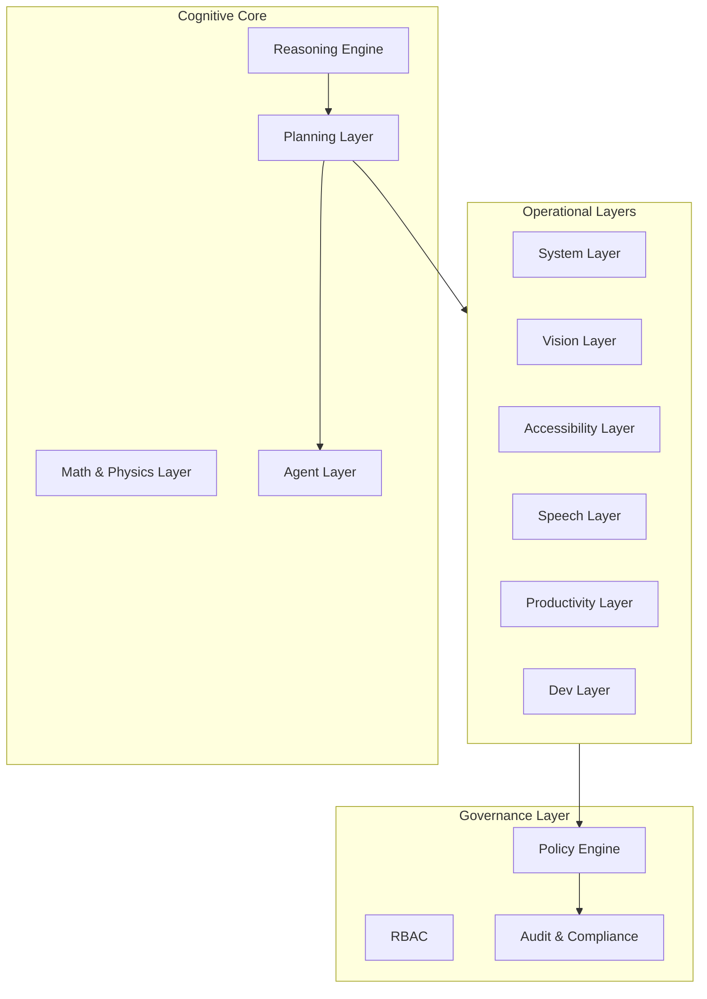

# MCL‑1.0 — Architecture Overview  

*A high‑level structural description of the Modular Cognitive Language.*

---

## 1. Introduction

MCL‑1.0 is a modular cognitive architecture composed of a central Reasoning Core, a set of specialized Operational Layers, and a deterministic Governance Layer.  
This document provides a structural overview of how these components interact.

---

## 2. High‑Level Architecture

MCL‑1.0 is organized into three major levels:

1. **Cognitive Core**  
2. **Operational Layers**  
3. **Governance Layer**

---

## 3. Architecture Diagram (Mermaid)

---

## 4. Cognitive Core

### 4.1 Reasoning Engine
- Semantic understanding  
- Logical inference  
- Contextual reasoning  
- Working memory  

### 4.2 Math & Physics Layer
- Symbolic computation  
- Numerical analysis  
- Invariant verification  

### 4.3 Planning Layer
- Intent decomposition  
- Task graph generation  
- Dry‑run simulation  
- Risk assessment  

### 4.4 Agent Layer
- Isolated agents  
- Scoped permissions  
- No self‑creation  
- No self‑expansion  

---

## 5. Operational Layers

### System Layer
Abstract model of the execution environment.

### Vision Layer
Visual perception and UI mapping.

### Accessibility Layer
Multimodal interaction and semantic navigation.

### Speech Layer
ASR, TTS, prosody control.

### Productivity Layer
Document reasoning and workflow orchestration.

### Dev Layer
Repository mapping, static analysis, refactoring planning.

---

## 6. Governance Layer

### Policy Engine
Deterministic enforcement of constraints.

### RBAC
Role‑based access control for all cognitive operations.

### Audit & Compliance
Full traceability of reasoning and planning.

---

## 7. Execution Pipeline

1. Input → Reasoning Engine  
2. Intent Parsing → Planning Layer  
3. Task Graph → Orchestrator  
4. Layer Activation → Operational Layers  
5. Policy Check → Governance Layer  
6. Risk Analysis → System Layer  
7. Dry‑Run Simulation → Planning Layer  
8. Plan Output → User  
9. Execution → Only after explicit approval  

---

## 8. Architectural Principles

- Modularity  
- Transparency  
- Safety  
- Replaceability  
- Vendor‑neutrality  
- Deterministic governance  

---

## 9. Purpose of This Document

This file provides a structural overview.  
For detailed definitions, refer to:

- `SPECIFICATION.md`  
- `MANIFESTO.md`  
