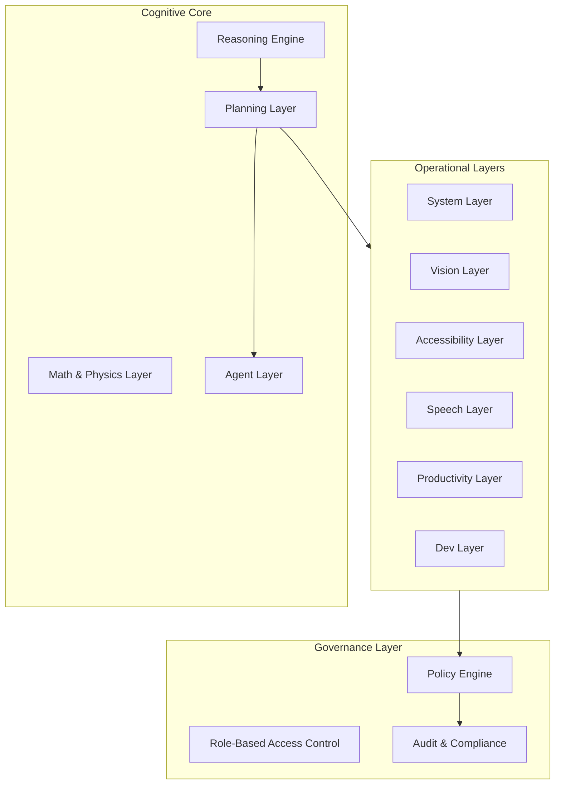

# **README.md — Complete Technical Version**

# **MCL‑1.0 — Modular Cognitive Language**  
*A vendor‑neutral cognitive architecture designed by Patrizio Melis.*

MCL‑1.0 is a formal cognitive architecture that defines how a reasoning system can be structured into a central cognitive core and a set of independent, replaceable operational layers.  
It is designed to overcome the limitations of monolithic AI models by introducing modularity, safety, transparency, and OS‑agnostic execution.

---

## **1. Overview**

**MCL‑1.0 (Modular Cognitive Language)** is not a chatbot, not a model, and not an assistant.  
It is a **language and framework for designing cognitive systems** composed of:

- a **Reasoning Core**  
- a **Planning Layer**  
- a **Math/Physics Layer**  
- a set of **Operational Layers** (System, Vision, Speech, Productivity, Dev)  
- a **Governance Layer**  

Each component is isolated, replaceable, and independently updatable.

MCL‑1.0 defines *how cognition should be structured*, not how a specific model should behave.

---

## **2. Vision**

The current AI landscape is dominated by monolithic models that:

- hallucinate  
- over‑generalize  
- lack internal modularity  
- behave unpredictably  
- attempt to please the user at all costs  
- hide their reasoning process  

This paradigm has reached its limit.

**MCL‑1.0 introduces a new era:  
AI as modular cognitive infrastructure.**

### **Key Innovations**
- **Pure Reasoning Core:** A central engine dedicated exclusively to reasoning, not multitasking.  
- **Layered Cognition:** Specialized modules (Math, System, Vision, Dev…) activated only when needed.  
- **Dry‑Run Safety:** Every plan is simulated before execution; nothing happens without explicit user approval.  
- **OS‑Agnostic Sovereignty:** MCL‑1.0 is not tied to any vendor, platform, or operating system.  
- **User‑Controlled:** No autonomous actions, no implicit permissions, no hidden processes.

---

## **3. Core Principles**

### **3.1 Modularity**
Every cognitive function is a separate module.  
No monolithic blocks.  
No implicit cross‑dependencies.

### **3.2 Safety by Design**
- No autonomous execution  
- No implicit access to resources  
- Mandatory dry‑run simulation  
- Full auditability  

### **3.3 Transparency**
All reasoning steps, plans, and alternatives must be explainable.

### **3.4 OS‑Agnostic Architecture**
MCL‑1.0 can operate in any environment capable of hosting its layers.

### **3.5 Deterministic Governance**
Policies, permissions, and constraints are part of the architecture, not an afterthought.

---

## **4. Architecture Overview**

MCL‑1.0 is structured into **three layers**:

1. **Cognitive Core**  
2. **Operational Layers**  
3. **Governance Layer**

### **4.1 Architecture Diagram (Mermaid)**

---

## **5. Components**

### **5.1 Reasoning Engine**
- semantic understanding  
- contextual reasoning  
- logical inference  
- working memory management  
- controlled chain‑of‑thought  

### **5.2 Math & Physics Layer**
- symbolic computation  
- algebra, geometry  
- physics simulation  
- algorithmic analysis  
- invariant verification  

### **5.3 Planning Layer**
- intent decomposition  
- task graph generation  
- multi‑layer orchestration  
- risk assessment  
- dry‑run simulation  
- explanation engine  

### **5.4 Agent Layer**
- isolated agents  
- scoped permissions  
- limited lifetime  
- no self‑creation  
- no self‑expansion  

---

## **6. Operational Layers**

### **6.1 System Layer**
- environment topology  
- protocol design  
- impact analysis  
- simulation engine  

### **6.2 Vision Layer**
- OCR  
- UI mapping  
- contextual object detection  
- visual debugging  

### **6.3 Accessibility Layer**
- navigation graph  
- semantic labeling  
- hands‑free interaction  

### **6.4 Speech Layer**
- ASR  
- TTS  
- prosody control  
- multi‑turn dialog  

### **6.5 Productivity Layer**
- document topology  
- multi‑document reasoning  
- workflow orchestration  
- formula intelligence  

### **6.6 Dev Layer**
- repository mapping  
- static analysis  
- cross‑language reasoning  
- refactoring planner  
- toolchain orchestration  

---

## **7. Governance Layer**

### **7.1 Policy Engine**
Deterministic enforcement of rules and constraints.

### **7.2 RBAC**
Role‑based access control for all cognitive operations.

### **7.3 Audit & Compliance**
Full traceability of reasoning, planning, and execution.

---

## **8. Execution Pipeline**

1. Input → Reasoning Engine  
2. Intent Parsing → Planning Layer  
3. Task Graph → Multi‑Layer Orchestrator  
4. Layer Activation → Operational Layers  
5. Policy Check → Governance Layer  
6. Risk Analysis → System Layer  
7. Dry‑Run Simulation → Planning Layer  
8. Plan Output → User  
9. Execution → Only after explicit approval  

---

## **9. System Properties**

- **No autonomous execution**  
- **No implicit permissions**  
- **Isolated contexts**  
- **Full auditability**  
- **Replaceable modules**  
- **Explainable reasoning**  
- **Vendor‑neutral integration**  

---

## **10. Project Status**

MCL‑1.0 is currently in the **conceptual and architectural design phase**.  
The framework is being defined through:

- the Technical Manifesto  
- the README  
- the Pitch  
- the Licensing model  

Future steps include:

- formal specification  
- reference implementation  
- modular layer prototypes  

---

## **11. Documentation**

- **Technical Manifesto:** `MANIFESTO.md`  
- **Pitch / Vision:** `PITCH.md`  
- **License:** `LICENSE`  

---

## **12. Author**

**Patrizio Melis**  
*Creator of the Modular Cognitive Language (MCL‑1.0)*

---
